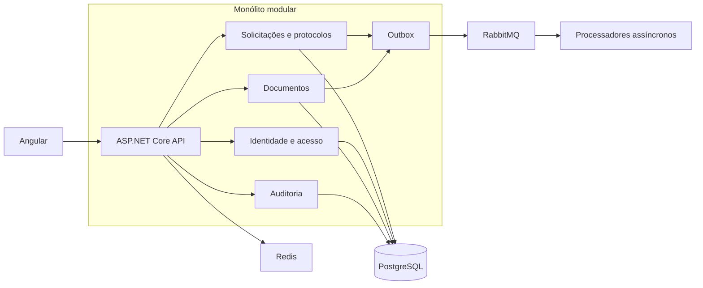

# Civic Operations Platform

Plataforma empresarial para gestão de processos administrativos: solicitações,
protocolos, responsáveis, comentários, anexos, prazos, auditoria e notificações.

O objetivo deste projeto é demonstrar como construir um sistema empresarial
consistente e observável em .NET sem transformar cada limite lógico em um
microsserviço artificial.

> **Status:** a primeira fatia vertical do backend está implementada, incluindo
> solicitações, integração assíncrona, anexos, papéis por tenant e auditoria de
> acessos sensíveis. A interface Angular e as evidências operacionais continuam
> em evolução conforme o roadmap.

## Por que um monólito modular?

Bounded contexts representam limites do modelo e da linguagem do negócio. Eles
não exigem, por si só, processos, bancos ou contêineres independentes.

Neste projeto, os módulos têm fronteiras explícitas no código e se comunicam por
contratos definidos, mas são implantados inicialmente como uma única aplicação.
Isso preserva consistência transacional, reduz custo operacional e mantém uma
rota de extração caso um limite realmente passe a exigir escala ou ciclo de
implantação independente.



## O que este projeto pretende comprovar

| Competência | Evidência no projeto |
|---|---|
| C# e .NET | APIs tipadas, nullable reference types, testes, tratamento de erros e código assíncrono |
| Modelagem de domínio | Agregados, value objects, invariantes, domain events e linguagem ubíqua |
| Decisões arquiteturais | ADRs, fronteiras de módulos, trade-offs e critérios explícitos de evolução |
| Integração assíncrona | Outbox transacional, RabbitMQ, consumidores idempotentes, retry e dead letter |
| Performance | Paginação, índices, projeções, cache mensurado e testes de carga reproduzíveis |
| Consistência | Transações locais, concorrência otimista, idempotência e cenários de recuperação |
| Sistemas empresariais reais | Multi-tenancy, autorização, auditoria, anexos, prazos e observabilidade |

O projeto não considera a presença de uma tecnologia como evidência suficiente.
Cada mecanismo relevante deve ser acompanhado por um cenário executável, teste
automatizado, métrica ou decisão documentada.

## Stack

- ASP.NET Core e Entity Framework Core
- PostgreSQL
- RabbitMQ
- Redis
- Angular com OpenID Connect e PKCE
- Keycloak para identidade local
- Docker Compose
- OpenTelemetry

## Módulos planejados

- **Tenancy:** organizações, contexto do tenant e isolamento de dados.
- **Identity & Access:** usuários, papéis e permissões.
- **Requests:** solicitações, protocolo, situação, prioridade, prazo e responsável.
- **Documents:** metadados, anexos e políticas de acesso.
- **Notifications:** Inbox idempotente, notificações, preferências, templates e
  entrega assíncrona.
- **Auditing:** trilha imutável de operações relevantes.

Os módulos não acessam diretamente as tabelas ou tipos internos uns dos outros.
Integrações síncronas usam contratos internos explícitos; efeitos assíncronos
partem de eventos gravados na Outbox.

## Princípios de implementação

- Um único deploy enquanto essa for a opção mais simples e segura.
- Fronteiras lógicas fortes, mesmo compartilhando processo e banco.
- Uma transação local para alterações que precisam ser atômicas.
- CQRS somente quando leitura e escrita possuem necessidades diferentes.
- Redis nunca é a fonte de verdade dos dados empresariais.
- Mensagens podem ser entregues mais de uma vez; consumidores devem ser idempotentes.
- Toda consulta multi-tenant deve ter isolamento verificável por testes.
- Performance é demonstrada por medidas, não por abstrações preventivas.
- Observabilidade faz parte do comportamento da aplicação.

## Documentação

- [Visão da arquitetura](docs/architecture/overview.md)
- [ADR-001: monólito modular como unidade de implantação](docs/adr/001-modular-monolith.md)
- [ADR-002: uso seletivo de CQRS](docs/adr/002-selective-cqrs.md)
- [ADR-003: Outbox para publicação confiável](docs/adr/003-transactional-outbox.md)
- [ADR-004: contexto de observabilidade através da Outbox](docs/adr/004-observability-context-through-outbox.md)
- [ADR-005: conteúdo de anexos fora do banco relacional](docs/adr/005-attachment-content-storage.md)
- [ADR-006: segurança básica de anexos](docs/adr/006-attachment-security-baseline.md)
- [ADR-007: papéis e permissões por tenant](docs/adr/007-tenant-roles-and-permissions.md)
- [ADR-008: auditoria de dados sensíveis](docs/adr/008-sensitive-data-audit.md)
- [ADR-009: projeções do dashboard](docs/adr/009-request-dashboard-projections.md)
- [ADR-010: índices do dashboard](docs/adr/010-request-dashboard-indexes.md)
- [ADR-011: cache medido do dashboard](docs/adr/011-request-dashboard-cache.md)
- [ADR-012: identidade autenticada com OpenID Connect](docs/adr/012-authenticated-identity-with-oidc.md)
- [Política de retenção de Outbox e auditorias](docs/operations/data-retention.md)
- [Teste de carga reproduzível do dashboard](docs/performance/2026-07-29-request-dashboard-load-test.md)
- [Objetivos de serviço, alertas e runbooks](docs/operations/service-objectives-and-alerts.md)
- [Roadmap orientado a evidências](docs/roadmap.md)

## Execução local

```powershell
docker compose up -d --build --wait
```

A composição inicia:

- frontend em `http://localhost:4200`;
- API em `http://localhost:5080`;
- RabbitMQ Management em `http://localhost:15672`;
- PostgreSQL, RabbitMQ e Redis nas portas documentadas em `.env.example`.

O Nginx do frontend encaminha `/api` para a API dentro da rede Docker. Consulte
os READMEs do [backend](Backend/README.md) e do [frontend](Frontend/README.md)
para desenvolvimento fora dos containers.

## CI e imagens Docker

O workflow
[`ci-dockerhub.yml`](.github/workflows/ci-dockerhub.yml) valida backend,
frontend, Docker Compose e regras Prometheus. Em pushes para `master`, tags
`v*` e execuções manuais, ele publica:

- `<usuario>/civic-operations-backend`;
- `<usuario>/civic-operations-frontend`.

Configure estes secrets na seção Actions secrets do repositório GitHub:

- `DOCKERHUB_USERNAME`: nome do usuário ou organização no Docker Hub;
- `DOCKERHUB_TOKEN`: access token do Docker Hub com permissão de leitura e
  escrita.

Pull requests executam somente as validações e nunca recebem as credenciais nem
publicam imagens. A branch padrão também recebe a tag `latest`; todas as
publicações recebem uma tag imutável `sha-<commit>`, e tags Git `v*` são
preservadas como tags Docker.

## Licença

MIT - veja [LICENSE](LICENSE).
