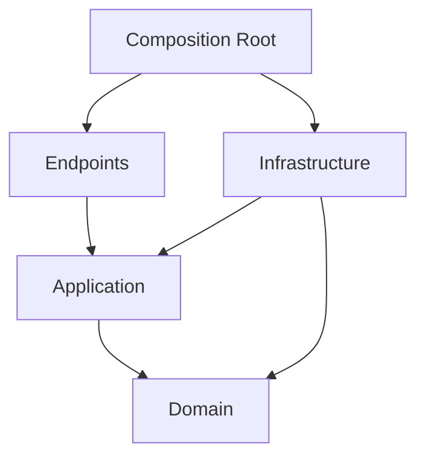

# Visão da arquitetura

## Objetivo

O Civic Operations Platform adota um monólito modular para concentrar a
complexidade no domínio e nos requisitos operacionais reais: consistência,
segurança, rastreabilidade, integração e evolução.

A arquitetura lógica é formada por bounded contexts. A arquitetura física
inicial possui uma API, processadores em background e dependências de
infraestrutura executadas por Docker Compose. A separação física de um módulo
será uma decisão posterior, baseada em evidências.

## Contextos e responsabilidades

| Contexto | Responsabilidade | Dados sob sua autoridade |
|---|---|---|
| Tenancy | Organizações e resolução do tenant | Tenant e configurações |
| Identity & Access | Identidade local, papéis e permissões | Usuário, papel e concessões |
| Requests | Ciclo de vida do processo administrativo | Solicitação, protocolo e atribuição |
| Documents | Registro e acesso a anexos | Metadados e referências de armazenamento |
| Notifications | Planejamento e acompanhamento de entregas | Preferências e tentativas |
| Auditing | Evidência imutável das operações | Eventos de auditoria |

Cada contexto controla seu modelo, mapeamento e schema no PostgreSQL. Uma
foreign key física entre módulos não substitui um contrato de integração.

## Estrutura do código

```text
Backend/
├── src/
│   ├── Api/                         # composition root e endpoints
│   ├── BuildingBlocks/
│   │   ├── Domain/                  # primitives sem dependências externas
│   │   ├── Application/             # comportamentos transversais
│   │   ├── Infrastructure/          # outbox, tenancy, persistência
│   │   └── Observability/           # traces, métricas e logs
│   └── Modules/
│       └── Requests/
│           ├── Domain/
│           ├── Application/
│           ├── Infrastructure/
│           └── Endpoints/
└── tests/
    ├── UnitTests/
    ├── IntegrationTests/
    ├── ArchitectureTests/
    └── PerformanceTests/
```

O número de assemblies será mantido proporcional ao ganho de isolamento. Pastas
e regras de dependência podem formar um limite válido; novos projetos serão
criados quando oferecerem proteção ou ciclo de build relevantes.

## Dependências permitidas



O domínio não depende de ASP.NET Core, EF Core, RabbitMQ ou Redis. A camada de
aplicação descreve casos de uso e portas. Infrastructure implementa essas portas.

## Consistência

Alterações dentro de um agregado e registros da Outbox participam da mesma
transação PostgreSQL. A publicação no RabbitMQ ocorre depois do commit.

Isso oferece publicação `at-least-once`, e não exatamente uma vez. Consumidores
registram o identificador da mensagem processada e tornam seus efeitos
idempotentes.

Operações concorrentes usam controle otimista. O cliente envia sua versão
conhecida e recebe `409 Conflict` quando o estado foi alterado por outro ator.

## Multi-tenancy

O modelo inicial utiliza banco compartilhado e coluna `tenant_id`:

- o tenant é obtido de uma identidade autenticada, não de um campo livre no body;
- filtros e comandos recebem o contexto do tenant;
- chaves naturais e índices únicos incluem `tenant_id`;
- testes de integração tentam deliberadamente acessar dados de outro tenant;
- jobs e consumidores restauram explicitamente o contexto do tenant.

Filtros globais do EF Core são uma defesa adicional, não a única barreira. Row
Level Security poderá ser avaliada após o primeiro fluxo vertical.

## Performance

As consultas de listagem retornam projeções e paginação no banco. Agregados são
carregados apenas para comandos que precisam executar suas invariantes.

Redis será introduzido somente em leituras com benefício mensurado. Toda chave
de cache inclui tenant e versão do contrato. O projeto deve registrar taxa de
acerto, latência e comportamento quando o Redis estiver indisponível.

## Observabilidade

OpenTelemetry propagará `trace_id`, `tenant_id`, `user_id` e `correlation_id`
entre requisições, transações da Outbox e consumidores, sem incluir conteúdo
sensível nos logs.

Serão observados, no mínimo:

- latência e taxa de erro dos endpoints;
- duração e volume das consultas ao PostgreSQL;
- tamanho e idade da Outbox;
- tentativas, falhas e dead letters;
- conflitos de concorrência;
- acertos e falhas do cache.

## Critérios para extrair um módulo

Um contexto só será considerado para implantação independente quando houver
evidência de pelo menos um destes fatores:

- necessidade de escala muito diferente do restante da aplicação;
- isolamento operacional ou regulatório;
- indisponibilidade aceitável diferente;
- equipe e cadência de entrega independentes;
- tecnologia especializada que não cabe no processo atual.

Mesmo nesses casos, o custo de consistência distribuída, observabilidade,
versionamento de contratos e operação deve ser comparado ao benefício.
